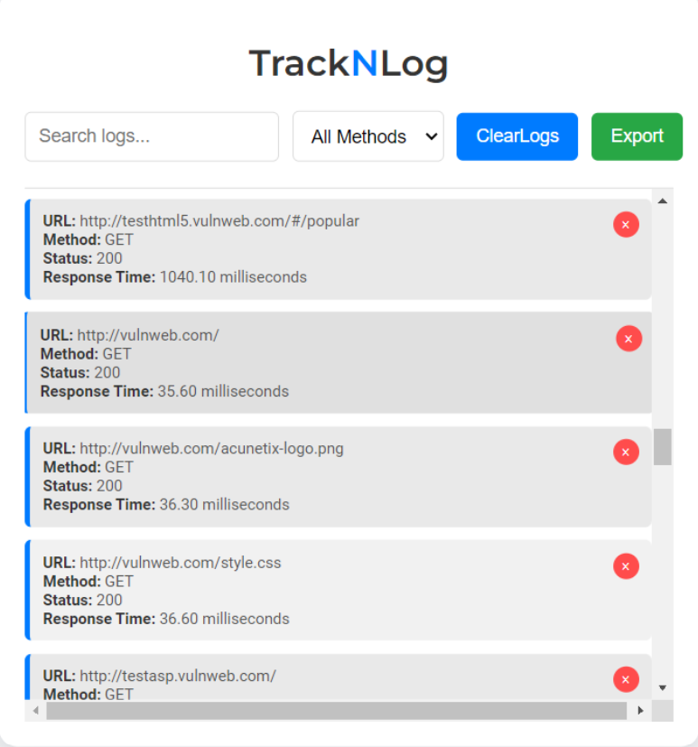

# TrackNLog

## Overview

TrackNLog is a Chrome extension designed to track and log website components and API calls. It provides an easy-to-use interface to monitor, filter, and export API request logs, helping developers debug and analyze web interactions.

## Features

- **Log API Calls:** Automatically logs all API requests made by the browser.
- **Filter Logs:** Filter logs by URL search term and HTTP method.
- **Clear Logs:** Clear all logged data with a single click.
- **Export Logs:** Export filtered logs to a JSON file for further analysis.
- **Response Time Measurement:** Measures and displays the response time of each API request.

 
 

## Installation

1. **Download or Clone the Repository:**

   ```bash
   git clone https://github.com/kunalnamdas/TrackNLog.git
   ```
2. **Load the Extension into Chrome:**
- Open Chrome and navigate to chrome://extensions/.

- Enable "Developer mode" by toggling the switch in the top right corner.

- Click on "Load unpacked" and select the directory where you downloaded or cloned the TrackNLog repository.

 # Usage

1 **Access the Extension:**

- Click on the TrackNLog icon in the Chrome toolbar to open the popup interface.
  
2. **View Logs:**

- The extension will automatically display API request logs.

3 **Filter Logs:**
- Use the search box and method filter dropdown to narrow down the logs.
  
4 **Clear Logs:**

- Click the "Clear Logs" button to remove all logs.
  
5 **Export Logs:**

- Click the "Export" button to download a JSON file of the filtered logs.
  
6 **Measure Response Time:**

The extension will display the response time for each API request.

# Development

To contribute to the development of TrackNLog:


1. **Fork the Repository:**

- Click the "Fork" button on the GitHub repository page to create a personal copy of the project.
  Make Changes:

2. **Create a new branch for your changes:**
     git checkout -b feature-branch

3 **Make your modifications and commit them:**

- git add .

- git commit -m "Description of your changes"

4 **Push Changes:**

- Push your changes to GitHub:
  
- git push origin feature-branch

5 . **Create a Pull Request:**

- Open a pull request on GitHub with a description of your changes.


# License

This project is licensed under the MIT License - see the LICENSE file for details.

Contact
 ```bash
For any questions or support, please contact kunaalnamdas@gmail.com
 ```

You can copy and paste this text directly into a file named `README.md`. Adjust the placeholders such as `your-username` and `your-email@example.com` to fit your specific details.


